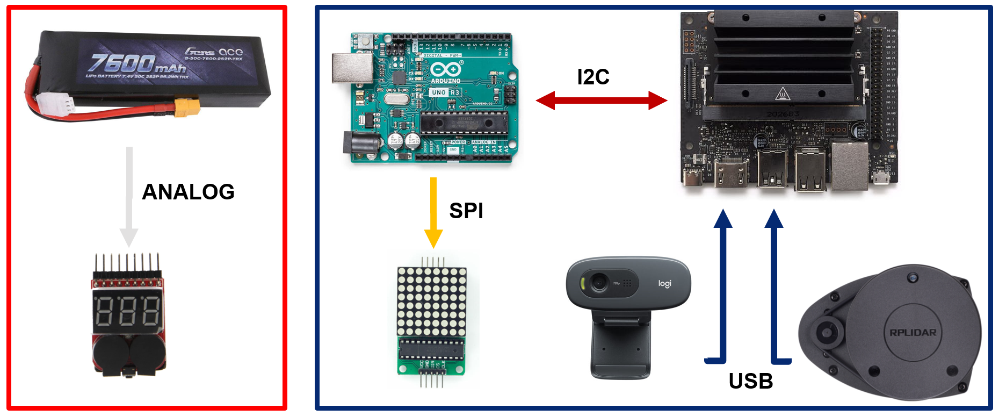

## **LHPU CAPSTONE FINAL PROJECT**

This is the repository of the final capstone project for the LHPU - Intro To Autonomous Mobility course. 

The aim of the project is to have two karts: a leading kart which follows a yellow line and avoids obstacles and a following
kart which follows the leading kart based on a green sign on the back of the leading kart.

### **BRIEF SPECIFICATIONS**

The specifications of the karts are as follows:

### **HARDWARE AND COMMUNICATION PROTOCOLS**

The leading kart has the following components and communication protocols:

The following kart has the following components and communication protocols:

### **CONTROL STRATEGIES LEADING KART**

The leading kart has proportional control **for throttle** based on battery voltage, distance to the obstacle and steering angle. 

The reason why the proportional control has been implemented on the steering angle is to prevent lateral instability and the reason it has been implemented on the battery voltage is to have a uniform speed throughout the operating time.
We have implemented quadratic curve fitting on battery voltage vs throttle as shown below based on experimental reasons.

The highlighted line below shows the proportional and derivative control for the **steering angle** based on the input provided by the OpenCV code.

### **CONTROL STRATEGIES FOLLOWING KART**

Similarly for the trailing kart, proportional and derivative **throttle control** was implemented based on distance between karts and steering angle.
The **steering angle control** was based on the input provided by the OpenCV code.